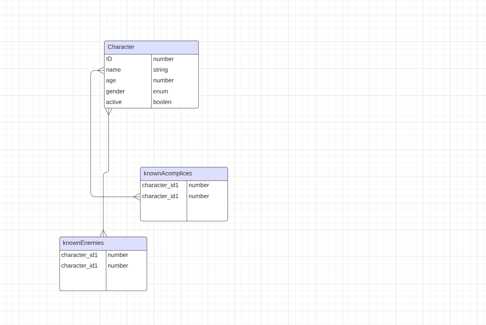

# This That back end

## Description

Simple nest.js api endpoint for marvel characters and their friends/enemies


## Installation

Ensure that you have Node.js, Nest.js and postgresql installed on your system then modifying the .env variables and make sure the docker variables are exactly the same. Note, you can run locally without docker.

Ensure you have an open db. I've used TablePlus. Use the same user, password and name that is stored in your .env

```bash
LOCAL DEPLOYMENT 
npm i
npm run start

access endpoint via https://localhost:3000/characters

DOCKER DEPLOYMENT 
npm i
docker build -t your-image-name:tag .
npm run down
npm run up

access endpoint via https://localhost:3001/characters
```

## Mock-Up

The following picture shows the relationship between the data ERD:




## SQL QUERIES


CRUD: 
  
```bash  
CREATE
# - Create a lonely character without enemies or accomplices:
INSERT INTO "character"("name", "age", "gender", "active") VALUES ($1, $2, $3, $4) RETURNING "id" -- PARAMETERS: ["Mr Marvel",20,"male",true]
# - Create a character with known enemies and accomplices:
SELECT "Character"."id" AS "Character_id", "Character"."name" AS "Character_name", "Character"."age" AS "Character_age", "Character"."gender" AS "Character_gender", "Character"."active" AS "Character_active" FROM "character" "Character" WHERE "Character"."id" IN ($1, $2) -- PARAMETERS: [1,2]
query: SELECT "Character"."id" AS "Character_id", "Character"."name" AS "Character_name", "Character"."age" AS "Character_age", "Character"."gender" AS "Character_gender", "Character"."active" AS "Character_active" FROM "character" "Character" WHERE "Character"."id" IN ($1, $2) -- PARAMETERS: [3,4]
successfully created a new character
query: SELECT "Character"."id" AS "Character_id", "Character"."name" AS "Character_name", "Character"."age" AS "Character_age", "Character"."gender" AS "Character_gender", "Character"."active" AS "Character_active" FROM "character" "Character" WHERE "Character"."id" IN ($1, $2, $3) -- PARAMETERS: [3,1,2]
query: SELECT "Character_knownAccomplices_rid"."characterId_1" AS "characterId_1", "Character_knownAccomplices_rid"."characterId_2" AS "characterId_2" FROM "character" "character" INNER JOIN "character_known_accomplices_character" "Character_knownAccomplices_rid" ON ("Character_knownAccomplices_rid"."characterId_1" = $1 AND "Character_knownAccomplices_rid"."characterId_2" = "character"."id") OR ("Character_knownAccomplices_rid"."characterId_1" = $2 AND "Character_knownAccomplices_rid"."characterId_2" = "character"."id") OR ("Character_knownAccomplices_rid"."characterId_1" = $3 AND "Character_knownAccomplices_rid"."characterId_2" = "character"."id") ORDER BY "Character_knownAccomplices_rid"."characterId_2" ASC, "Character_knownAccomplices_rid"."characterId_1" ASC -- PARAMETERS: [1,3,2]
query: SELECT "Character_knownEnemies_rid"."characterId_1" AS "characterId_1", "Character_knownEnemies_rid"."characterId_2" AS "characterId_2" FROM "character" "character" INNER JOIN "character_known_enemies_character" "Character_knownEnemies_rid" ON ("Character_knownEnemies_rid"."characterId_1" = $1 AND "Character_knownEnemies_rid"."characterId_2" = "character"."id") OR ("Character_knownEnemies_rid"."characterId_1" = $2 AND "Character_knownEnemies_rid"."characterId_2" = "character"."id") OR ("Character_knownEnemies_rid"."characterId_1" = $3 AND "Character_knownEnemies_rid"."characterId_2" = "character"."id") ORDER BY "Character_knownEnemies_rid"."characterId_2" ASC, "Character_knownEnemies_rid"."characterId_1" ASC -- PARAMETERS: [1,3,2]
query: START TRANSACTION
query: INSERT INTO "character"("name", "age", "gender", "active") VALUES ($1, $2, $3, $4) RETURNING "id" -- PARAMETERS: ["Doctor Strange",20,"male",true]
query: INSERT INTO "character_known_accomplices_character"("characterId_1", "characterId_2") VALUES ($1, $2) -- PARAMETERS: [6,3]
query: INSERT INTO "character_known_enemies_character"("characterId_1", "characterId_2") VALUES ($1, $2), ($3, $4) -- PARAMETERS: [6,1,6,2]
```

```bash  
READ
# - Read all characters
SELECT * FROM "character"
# - Read all the data in the database: 
SELECT * 
FROM "character" "Character" LEFT JOIN "character_known_accomplices_character" "Character_Character__Character_knownAccomplices" ON "Character_Character__Character_knownAccomplices"."characterId_1"="Character"."id" LEFT JOIN "character" "Character__Character_knownAccomplices" ON "Character__Character_knownAccomplices"."id"="Character_Character__Character_knownAccomplices"."characterId_2"  
```

```bash  
UPDATE
# - Update a character
UPDATE "character" SET "name" = $1, "age" = $2, "gender" = $3, "active" = $4 WHERE "id" IN ($5) -- PARAMETERS: ["Goku",20,"male",true,"8"]
```

```bash  
DESTROY
# - delete character
DELETE FROM "character" WHERE "id" IN ($1) -- PARAMETERS: ["9"]
```


###

Written by Christian Alteri

To learn more about other projects, [click here](https://github.com/ChristianAlteri/marvel-api).

####

[](LICENSE)